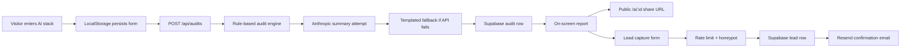

# Architecture

## Data Flow

A visitor selects tools, plans, monthly spend, seats, team size, and primary use case. The browser saves this form to `localStorage`, then posts it to `/api/audits`. The API validates the payload with Zod, runs deterministic pricing rules, asks Anthropic for a short personalized summary, falls back to a local template if needed, and stores the public audit payload. The report shows immediately and links to `/a/:id`, which strips private lead details and exposes only tools, recommendations, and savings.

## Stack Choice

I chose Next.js with TypeScript because the assignment needs more than a static page: API routes, deployable backend behavior, metadata for share previews, and production-friendly routing. TypeScript keeps the audit engine explicit and testable. Supabase is used for durable audit and lead storage because it is quick to set up, has a generous free tier, and maps cleanly to the assignment's backend requirement. Resend handles transactional email with a simple API.

## 10k Audits/Day

At 10k audits/day I would move rate limiting to Upstash Redis or Cloudflare Turnstile, make summary generation asynchronous, store audit events in a queue, and cache public report pages. I would also split audit rules into versioned rule packs so pricing changes can be updated without changing historical reports.
