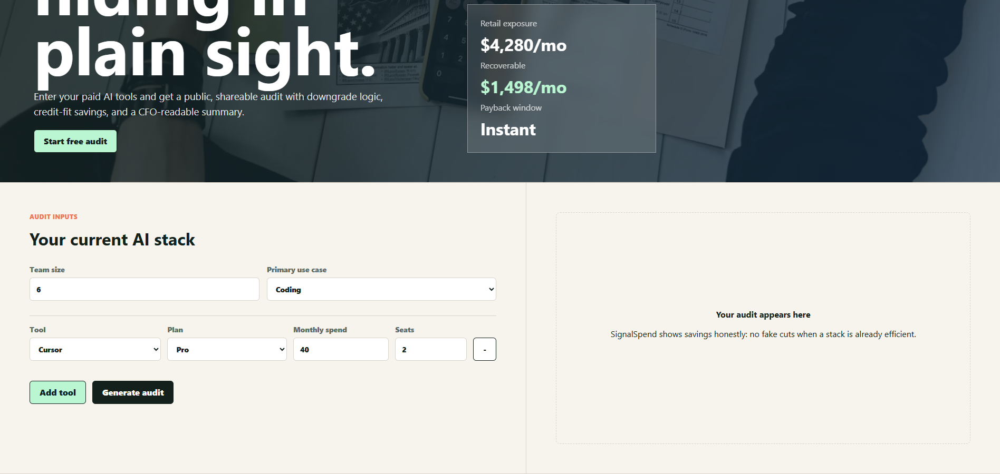
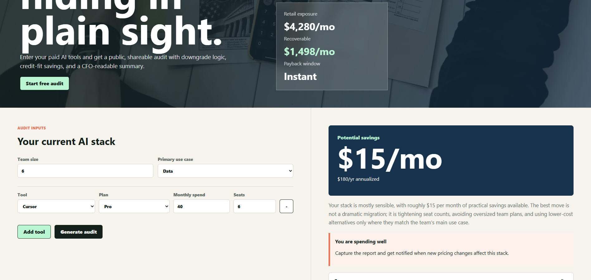
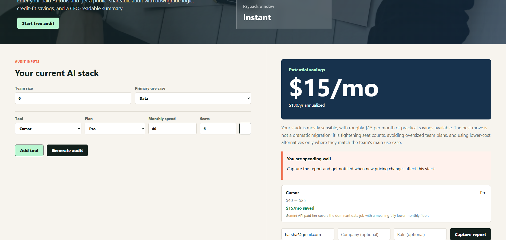

# SignalSpend

SignalSpend is a free AI spend audit for startup founders and engineering managers who pay for tools like Cursor, Copilot, Claude, ChatGPT, Gemini, OpenAI API, Anthropic API, and v0. It turns a messy monthly AI bill into a shareable savings memo with per-tool recommendations, annualized savings, lead capture, and a Credex consultation path for high-savings cases.

**Live URL:** Add your deployed Vercel URL here.

## Screenshots

Screenshots from the local MVP run:

### Landing page

The first screen introduces SignalSpend as a founder-friendly AI spend audit and shows the example savings board.


### Audit input form

Users enter team size, primary use case, AI tool, plan, monthly spend, and seat count. The form persists across reloads.



### Audit result and lead capture

After generating an audit, SignalSpend shows savings, explains the recommendation, creates a public report URL, and captures the email only after value is shown.



### Captured report state

The lead capture flow confirms the report was captured and is ready for transactional email once Resend is configured.



> Note: replace these local screenshot files with fresh deployed screenshots before final submission.

## Quick Start

```bash
npm install
npm run dev
```

Open `http://localhost:3000`.

## Environment

Copy `.env.example` to `.env.local` and fill:

```bash
NEXT_PUBLIC_APP_URL=http://localhost:3000
ANTHROPIC_API_KEY=
SUPABASE_URL=
SUPABASE_SERVICE_ROLE_KEY=
RESEND_API_KEY=
AUDIT_EMAIL_FROM=SignalSpend <audit@yourdomain.com>
```

Without these keys, the app still runs locally with in-memory audit storage and a templated summary. For a real submission, configure Supabase and Resend so share URLs and lead capture survive server restarts.

## Deploy

1. Push this repo to GitHub.
2. Import it into Vercel.
3. Add the environment variables above.
4. Create Supabase tables using this shape:

```sql
create table audits (
  id text primary key,
  payload jsonb not null,
  total_monthly_savings numeric not null default 0,
  created_at timestamptz not null default now()
);

create table leads (
  id bigint generated by default as identity primary key,
  audit_id text references audits(id),
  email text not null,
  company text,
  role text,
  team_size integer,
  created_at timestamptz not null default now()
);
```

## Decisions

- **Next.js over Vite:** API routes, dynamic Open Graph metadata, and Vercel deployment are first-class, which matches the assignment.
- **Rule-based audit math:** Savings logic is deterministic and testable; AI is only used for the personalized summary.
- **Email after value:** Users see savings first, then capture the report, matching the assignment’s “no gate before value” rule.
- **Supabase optional locally:** In-memory fallback keeps development fast while production uses a real backend.
- **Honest low-savings state:** The app says “you are spending well” rather than inventing recommendations.
